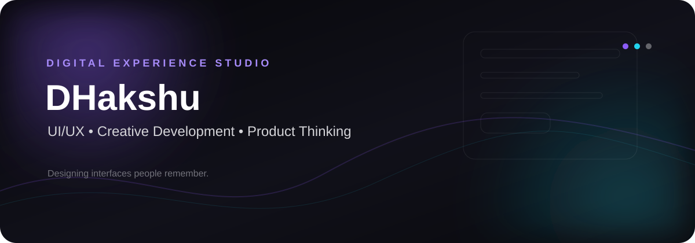

<!-- DAKSHATA A A | UI/UX + Computer Science Portfolio -->

 

---

## 01 / PROFILE

> ### **I design interfaces with clarity, curiosity and a builder's mindset.**

I'm **Dakshata A A**, a **BSc Computer Science student** with a strong interest in **UI/UX design, frontend experiences and digital product thinking**.

I enjoy moving from **idea → structure → interface → implementation**, combining visual thinking with technical foundations.

My sweet spot is where **design meets code**.

| DESIGN | BUILD | THINK |
|:---:|:---:|:---:|
| UI/UX · Figma | HTML · C++ · Java | Problem Solving · Analytical Thinking |
| Prototyping · Layouts | Python · SQL · DBMS | Communication · Leadership |
| Visual Hierarchy | Frontend Foundations | User-focused Thinking |

---

## 02 / DESIGN POINT OF VIEW

<table>
<tr>
<td width="25%" align="center">

### 01
**CLARITY**

Make the next action obvious.

</td>
<td width="25%" align="center">

### 02
**STRUCTURE**

Organize information before styling it.

</td>
<td width="25%" align="center">

### 03
**DETAIL**

Small interactions shape the experience.

</td>
<td width="25%" align="center">

### 04
**PURPOSE**

Every visual element should earn its place.

</td>
</tr>
</table>

---

## 03 / EXPERIENCE

### **ATS ELGI Pvt. Ltd. — Ex-Intern**
**May 02, 2025 — June 04, 2025**

**Design + Implementation**

- Led the design and implementation process for multiple landing pages across different projects.
- Worked across the visual and implementation side of web experiences.
- Focused on creating clear, usable and visually structured landing-page layouts.

> **Experience focus:** Landing Pages · UI Design · Implementation · Visual Structure

---

## 04 / SELECTED WORK

### ◇ RECIPE FINDER
**Jun 2024 — Nov 2024**

An application designed to help users find the recipe they need quickly.

**Role / Focus:** Interface · User Flow · Frontend

**Tech:** HTML · CSS · JavaScript

---

### ◇ COMPANY CHATBOT

A company-assistance chatbot developed to make product and company information easier to access.

**Role / Focus:** Information Access · User Interaction · Problem Solving

**Tech direction:** Programming · Data Handling · User-focused Interaction

---

### ◇ UI / UX DESIGN EXPLORATIONS

A growing space for experimenting with:

**Wireframes · Figma · Landing Pages · Responsive Layouts · Visual Hierarchy · Micro-interactions · Design Systems**

---

## 05 / CREATIVE PLAYGROUND

> **A visual interaction study — not a game.**
>
> Motion, rhythm, feedback and hierarchy are used here as design principles.

---

## 06 / DESIGN TOOLKIT

### UI / UX

### Development

---

## 07 / COMPUTER SCIENCE FOUNDATION

<table>
<tr><td>Data Structures & Algorithms</td><td>Database Management Systems</td></tr>
<tr><td>Operating Systems</td><td>Computer Networks</td></tr>
<tr><td>Object-Oriented Programming</td><td>Problem Solving</td></tr>
</table>

---

## 08 / EDUCATION

### **Sri Krishna Arts and Science College — 2026**
**BSc in Computer Science**

**CGPA: 8.9**

### **Vivek Vidya Mandir CBSE**
**SSLC — 2021:** 88%

**Vivek Vidyalaya Matric Hr. Sec. School**  
**HSC — 2023:** 83%

---

## 09 / CERTIFICATIONS

| Certification | Provider |
|---|---|
| **UI/UX Using Figma** | Sri Krishna I-Tech and Management |
| **Developing and Enhancing Soft Skills** | NPTEL |
| **Cybersecurity Foundation** | Coursera |
| **C, C++, Java, RDBMS** | Spoken Tutorial |

---

## 10 / ACHIEVEMENT

### **National Conference**
**On Deep Learning & Computer Interaction for Sustainability**

---

## 11 / PEOPLE SKILLS

**Communication** · **Leadership** · **Time Management** · **Analytical Thinking** · **Problem Solving**

---

## 12 / BEYOND THE SCREEN

**Pencil Sketching**  
**Artist**  
**Handball Player**

I like the same things in physical art and digital design:

**Observation · Balance · Rhythm · Expression**

---

## 13 / LANGUAGES

**Tamil** · **English** · **Hindi (Basic)**

---

## 14 / CURRENT FOCUS

### **Design better. Build smarter. Keep the experience human.**

**UI/UX → Frontend → Product Thinking**

---

## 15 / GITHUB SIGNAL

 

---

## 16 / LET'S CONNECT

### **Have an idea worth designing?**

Let's turn it into something people can understand, use and remember.

 

  

**dakshataanand@gmail.com**  
**linkedin.com/dhakshuanand**

---

### **DESIGNED WITH INTENTION. BUILT WITH CURIOSITY.**

**Dakshata A A · UI/UX Designer · Computer Science**

